```python
import numpy as np
import matplotlib.pyplot as plt
from numpy.polynomial import Polynomial
import math
```


```python
def f(x):
  return math.e ** -(x ** 2)

def der_f(x):
  return -2 * x * math.e ** -(x ** 2)

x_min = -5
x_max = 5
```

Код для рисования графиков. В функцию plot_results достаточно передать только имя графика и фукнтор, который примет узлы и вернёт еще один функтор, который по данной точке x вернёт точку y интерполированной функции


```python
def show_plot(name, interpolated, names, nodes=None, cnt=100):
  plot_count = 2 * len(interpolated)
  fig = plt.figure(figsize=(10, 5 * plot_count))
  x_label = 'x'
  y_label = 'y'
  xs = np.linspace(x_min, x_max, cnt)

  for polynomial, plot_name, plot_num in zip(
      interpolated, names, range(1, len(interpolated) + 1)):
    ax = fig.add_subplot(plot_count, 2, plot_num * 2 - 1)
    ax.title.set_text(name)
    ax.grid(linestyle='--')
    ax.set_ylim([1.5 * min(map(f, xs)) - 0.2, 1.5 * max(map(f, xs)) + 0.2])
    ax.set_xlabel(x_label)
    ax.set_ylabel(y_label)

    if nodes is not None:
      ax.scatter(nodes[plot_num - 1], list(map(f, nodes[plot_num - 1])), marker='x', c='r', label='Узлы')
    ax.plot(xs, list(map(f, xs)), '-', label='f(x)')
    ax.plot(xs, list(map(polynomial, xs)), '--', label=plot_name)

    plt.legend()

    ax = fig.add_subplot(plot_count, 2, plot_num * 2)
    ax.title.set_text('Разность')
    ax.set_ylim([0, 2])
    ax.grid(linestyle='--')
    ax.set_xlabel(x_label)
    ax.set_ylabel(y_label)

    if nodes is not None:
      ax.scatter(nodes[plot_num - 1], [0 for _ in nodes[plot_num - 1]], marker='o', c='r', label='Узлы')
    ax.plot(xs, [abs(f(x) - polynomial(x)) for x in xs], '-', label='|f(x) - p(x)|')

    plt.legend()

  plt.show()


def plot_results(name, 
                 get_interpolation, 
                 get_nodes=lambda x: np.linspace(x_min, x_max, x), 
                 node_counts=[6, 9, 12, 18]):
  show_plot(name, 
            [get_interpolation(get_nodes(i)) for i in node_counts], 
            [str(i) + " узлов" for i in node_counts],
            [get_nodes(i) for i in node_counts])
```

Тут я получаю интерполяционный многочлен как решение СЛАУ


```python
def interpolation_polynomial(nodes):
  node_cnt = len(nodes)
  a = np.array([nodes ** i for i in range(node_cnt)]).transpose()
  y = np.array(list(map(f, nodes)))
  x = np.linalg.solve(a, y)
  return Polynomial(x)
```

Функция возвращает список узлов Чебышева для отрезка, заданного во второй ячейке блокнота


```python
def cheb_nodes(node_cnt):
  return np.array([math.cos(math.pi * (2 * i + 1) / (2 * node_cnt + 2)) * (x_max - x_min) / 2 + (x_min + x_max) / 2 for i in reversed(range(node_cnt))])
```

Код, который реализует метод Эрмита (как частный случай и метод Ньютона) для интерполяции


```python
def duplicate_nodes(nodes):
  return [nodes[i // 2] for i in range(len(nodes) * 2)]


cache = dict()
def get_separate_difference(start, finish, nodes):
  if (start, finish) in cache:
    return cache.get((start, finish))

  if start == finish:
    cache[(start, finish)] = f(nodes[start])
  elif nodes[start] == nodes[finish]:
    cache[(start, finish)] = der_f(nodes[start])
  else:
    cache[(start, finish)] = (get_separate_difference(start, finish - 1, nodes) - 
                              get_separate_difference(start + 1, finish, nodes)) / \
                              (nodes[start] - nodes[finish])
  return cache.get((start, finish))


def get_separate_differences(nodes):
  cache.clear()
  return [get_separate_difference(0, i, nodes) for i in range(len(nodes))]


def get_newton_polynomial_value_in(t, nodes, sep_diffs):
  ans = 0
  coef = 1
  for sep_diff, node in zip(sep_diffs, nodes):
      ans += sep_diff * coef
      coef *= (t - node)
  return ans


def get_newton_polynomial(nodes):
  sep_diffs = get_separate_differences(nodes)
  return lambda x: get_newton_polynomial_value_in(x, nodes, sep_diffs)
```

Задание 5: берём всё больше точек для построения интерполяции и проверяем точность. Тут я нахожу интерполяционный многочлен уже методом Ньютона, что демонстрирует, что оба варианта работоспособны.

Результатом выполнения кода можно увидеть ответы для sqrt(2) / 2 и pi / 7 для метода Ньютона и Эрмита


```python
def get_dot_value(dot, use_ermit):
  all_nodes = sorted(np.linspace(x_min, x_max, 100), key=lambda x: abs(x - dot))
  best_dot = None
  best_count = None
  for nodes_count in range(1, 100):
    poly = None
    if use_ermit:
      poly = get_newton_polynomial(duplicate_nodes(sorted(all_nodes[:nodes_count])))
    else:
      poly = get_newton_polynomial(sorted(all_nodes[:nodes_count]))
    if abs(poly(dot) - f(dot)) < 1e-10:
      best_dot = poly(dot)
      best_count = nodes_count
      break
  print("Интерполяция Эрмита" if use_ermit else "Интерполяционный многочлен")
  print(f"f({dot}):", f(dot))
  print("Удалось получить значение:", best_dot)
  print("Точность:", abs(best_dot - f(dot)))
  print("Понадобилось узлов:", best_count)
  print()


get_dot_value(math.sqrt(2) / 2, False)
get_dot_value(math.sqrt(2) / 2, True)

get_dot_value(math.pi / 7, False)
get_dot_value(math.pi / 7, True)
```

    Интерполяционный многочлен
    f(0.7071067811865476): 0.6065306597126334
    Удалось получить значение: 0.6065306597670808
    Точность: 5.4447335529062e-11
    Понадобилось узлов: 11
    
    Интерполяция Эрмита
    f(0.7071067811865476): 0.6065306597126334
    Удалось получить значение: 0.6065306597113312
    Точность: 1.3021805855828461e-12
    Понадобилось узлов: 5
    
    Интерполяционный многочлен
    f(0.4487989505128276): 0.817568573328328
    Удалось получить значение: 0.817568573364442
    Точность: 3.611400067882187e-11
    Понадобилось узлов: 10
    
    Интерполяция Эрмита
    f(0.4487989505128276): 0.817568573328328
    Удалось получить значение: 0.8175685732965133
    Точность: 3.181466201596095e-11
    Понадобилось узлов: 3
    


Много кода для реализации кубических сплайнов. Код может работать не только с равноотстоящими точками, для чего были реализованы функции get_h_i, get_e_i и get_c_i. В дальнейшем я использовал этот код с минимальными изменениями для построения бикубического сплайна


```python
def get_h_i(nodes, i):
  return nodes[i] - nodes[i - 1]


def get_y_i(nodes, i):
  return f(nodes[i])


def get_alpha_i(nodes, i):
  return get_y_i(nodes, i)


def get_teta_i(nodes, gammas, i):
  return (gammas(i) - gammas(i - 1)) / get_h_i(nodes, i)


def get_beta_i(nodes, gammas, i):
  h_i = get_h_i(nodes, i)
  return (get_y_i(nodes, i) - get_y_i(nodes, i - 1)) / h_i + \
        (2 * gammas(i) + gammas(i - 1)) * h_i / 6


def get_e_i(nodes, i):
  return get_h_i(nodes, i + 1) / (get_h_i(nodes, i) + get_h_i(nodes, i + 1))


def get_c_i(nodes, i):
  return get_h_i(nodes, i) / (get_h_i(nodes, i) + get_h_i(nodes, i + 1))


def get_b_i(nodes, i):
  x_1 = nodes[i - 1]
  x_2 = nodes[i]
  x_3 = nodes[i + 1]
  f_1 = (get_y_i(nodes, i) - get_y_i(nodes, i - 1)) / (x_2 - x_1)
  f_2 = (get_y_i(nodes, i + 1) - get_y_i(nodes, i)) / (x_3 - x_2)
  ans = (f_2 - f_1) / (x_3 - x_1)
  return 6 * ans


def get_gammas(nodes):
  n = len(nodes)
  a = np.zeros((n - 2, n - 2))
  a[0, 0] = 2
  a[0, 1] = get_e_i(nodes, 1)
  for i in range(1, n - 3):
    a[i, i - 1] = get_c_i(nodes, i + 1)
    a[i, i] = 2
    a[i, i + 1] = get_e_i(nodes, i + 1)
  a[n - 3, n - 4] = get_c_i(nodes, n - 2)
  a[n - 3, n - 3] = 2
  b = np.array([get_b_i(nodes, i) for i in range(1, n - 1)])
  return np.linalg.solve(a, b)


def get_gamma_i(gammas, i):
  if i - 1 not in range(len(gammas)):
    return 0
  return gammas[i - 1]


def get_splines(nodes):
  gammas = get_gammas(nodes)
  get_gamma = lambda i: get_gamma_i(gammas, i)
  splines = [[get_alpha_i(nodes, i),
              get_beta_i(nodes, get_gamma, i),
              get_gamma(i),
              get_teta_i(nodes, get_gamma, i)] for i in range(1, len(nodes))]
  return splines


def get_spline_value(spline, xi, x):
  return spline[0] + spline[1] * (x - xi) + spline[2] * (x - xi) ** 2 / 2 + \
            spline[3] * (x - xi) ** 3 / 6


def get_splines_value(nodes, splines, t):
  for i in range(1, len(splines)):
    if t <= nodes[i]:
      return get_spline_value(splines[i - 1], nodes[i], t)
  return get_spline_value(splines[-1], nodes[-1], t)


def get_spline(nodes):
  splines = get_splines(nodes)
  return lambda x: get_splines_value(nodes, splines, x)
```

Реализация МНК "в лоб"


```python
def get_basis_function_i(i):
  return lambda x: x ** i


def get_phi_i(nodes, i):
  return np.array(list(map(get_basis_function_i(i), nodes)))


def get_gammas_matrix(nodes, basis_size):
  res = np.zeros((basis_size, basis_size))
  phis = [get_phi_i(nodes, i) for i in range(basis_size)]
  for i in range(basis_size):
    for j in range(basis_size):
      res[i, j] = phis[i].dot(phis[j])
  return res


def get_betas(nodes, basis_size):
  phis = [get_phi_i(nodes, i) for i in range(basis_size)]
  ys = np.array(list(map(f, nodes)))
  return np.array(list(map(ys.dot, phis)))


def get_RMS(nodes, basis_size):
  gammas = get_gammas_matrix(nodes, basis_size)
  betas = get_betas(nodes, basis_size)
  alphas = np.linalg.solve(gammas, betas)
  return lambda t: sum([get_basis_function_i(i)(t) * alphas[i] for i in range(basis_size)])


def get_RMS_with_basis_size(basis_size):
  return lambda nodes: get_RMS(nodes, basis_size + 1)
```

Следующие графики говорят сами за себя: многочлен плохо интерполирует функцию, особенно в местах, где она принимает вид горизонтальной прямой


```python
plot_results('Интерполяционный многочлен по равноотстоящим', interpolation_polynomial)
```


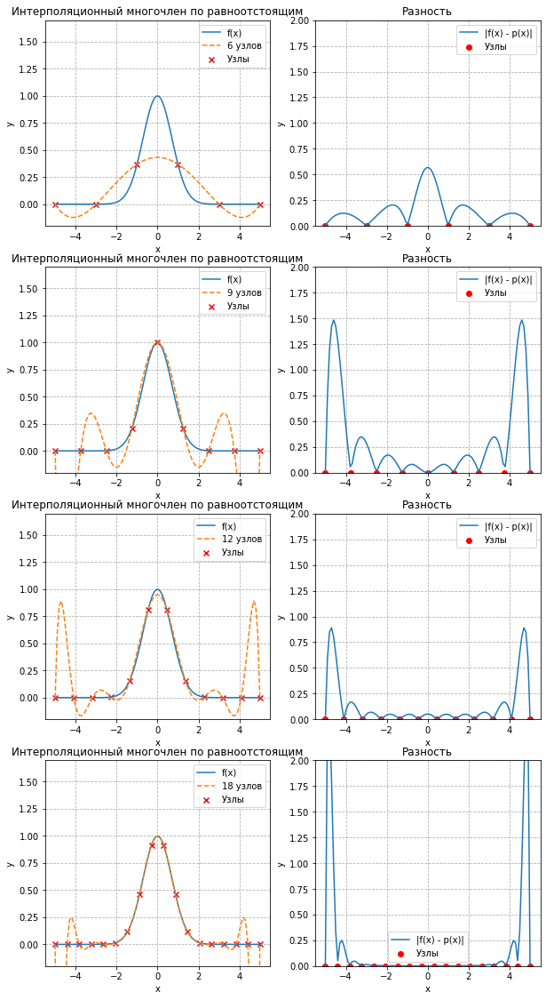


Использование узлов Чебышева значительно улучшает интерполяцию, что видно по графикам разности. Разность "улетает" в бесконечность на концах из-за того, что узлы Чебышева не обязательно покрывают начало и конец графика в отличие от прошлого случая с равноотстоящими узлами. Нас в меньшей степени должна интересовать ситуация на концах отрезка.


```python
plot_results('Интерполяционный многочлен по узлам Чебышева', 
             interpolation_polynomial,
             cheb_nodes)
```


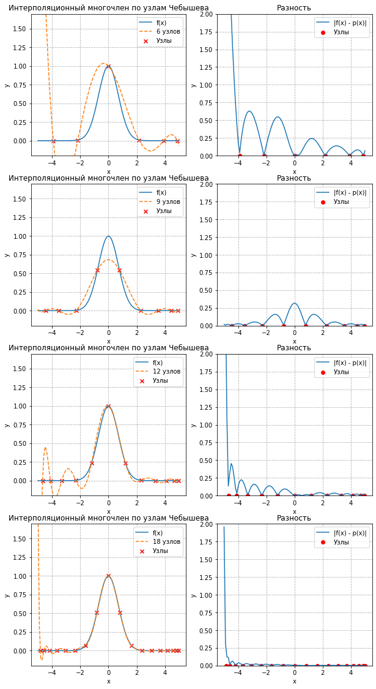


Эрмитова интерполяция намного лучше справляется с горизонтальными участками графика благодаря равенству первой производной в узлах интерполяции


```python
plot_results('Эрмитова интерполяция',
             get_newton_polynomial,
             lambda x: duplicate_nodes(np.linspace(x_min, x_max, x)))
```


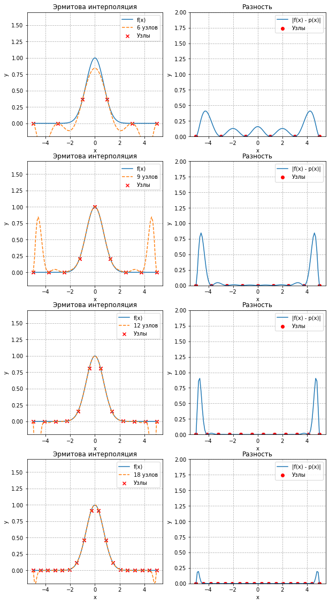


Узлы Чебышева снова улучшили интерполяцию, в этот раз уже на 9 узлах график разности практически лёг на ось Х


```python
plot_results('Эрмитова интерполяция по узлам Чебышева',
             get_newton_polynomial,
             lambda x: duplicate_nodes(cheb_nodes(x)))
```


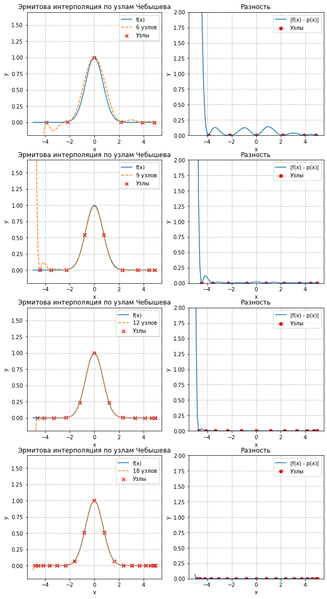


Кубические сплайны отлично справились с данным графиком. Особенно в ситуации, когда один из узлов попадает на вершину "параболы"


```python
plot_results("Кубические сплайны", get_spline)
```


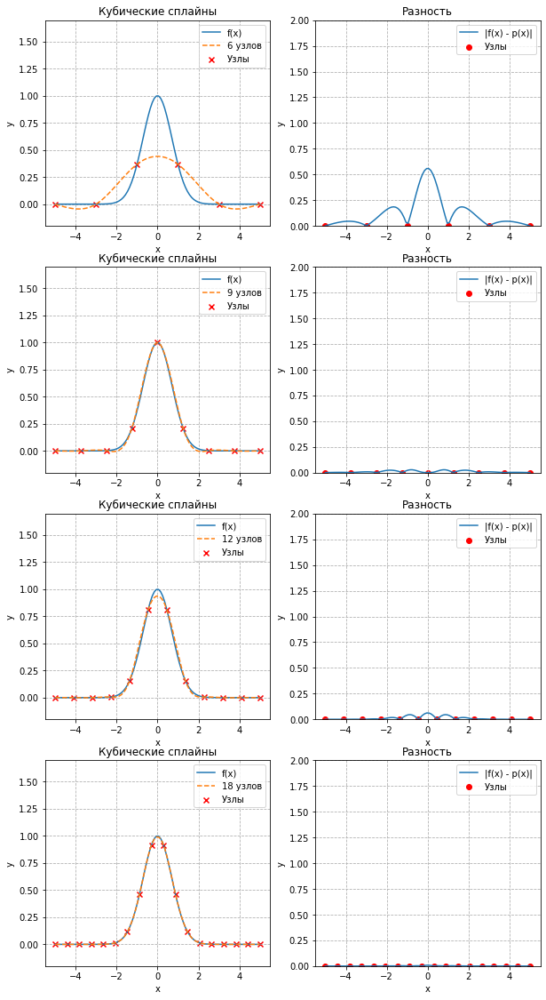


Для демонстрации корректной работы алгоритма построения кубических сплайнов по неравноотстоящим узлам, я также построил их по узлам Чебышева, хотя кажется это не имеет обоснования


```python
plot_results("Кубические сплайны по узлам Чебышева", get_spline, cheb_nodes)
```


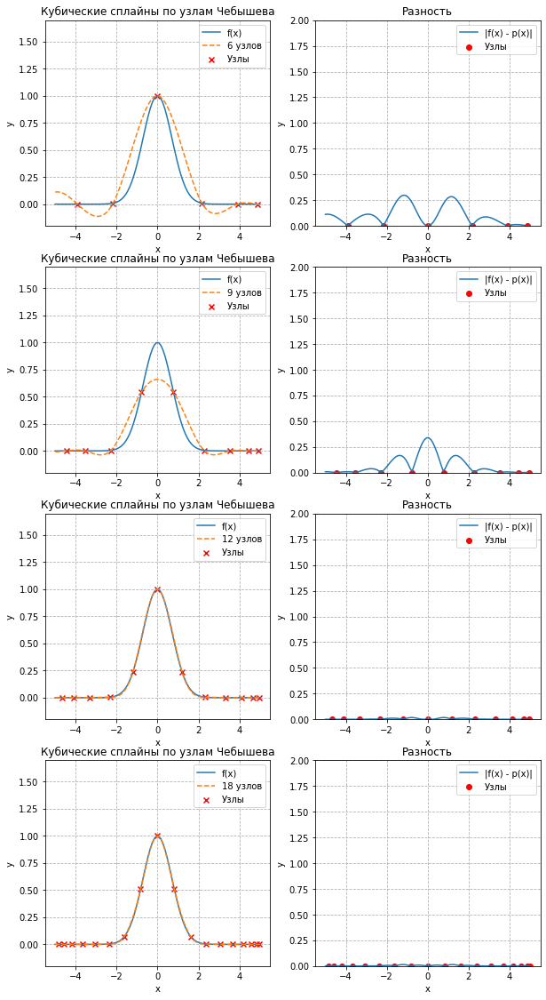


Метод наименьших квадратов и то, что и столо от него ожидать: прямая, парабола...


```python
plot_results("RMS 1", get_RMS_with_basis_size(1),
             lambda count: np.sort(np.random.rand(100) * (x_max - x_min) + x_min),
             [100])
plot_results("RMS 2", get_RMS_with_basis_size(2),
             lambda count: np.sort(np.random.rand(100) * (x_max - x_min) + x_min),
             [100])
plot_results("RMS 4", get_RMS_with_basis_size(4),
             lambda count: np.sort(np.random.rand(100) * (x_max - x_min) + x_min),
             [100])
plot_results("RMS 6", get_RMS_with_basis_size(6),
             lambda count: np.sort(np.random.rand(100) * (x_max - x_min) + x_min),
             [100])
```


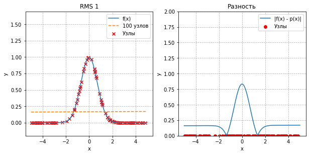


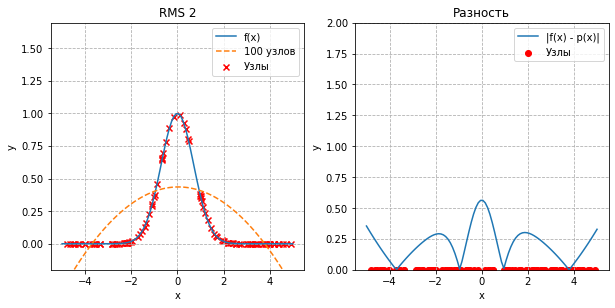


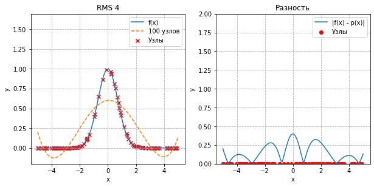


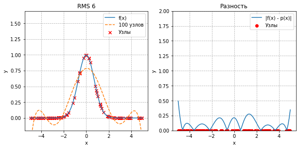


```python
import numpy as np
import matplotlib.pyplot as plt
from numpy.polynomial import Polynomial
import math
```


```python
def f(x, y):
  return (x + y) * (np.cos(x) + np.cos(y))

f_min = 0
f_max = 11
```

Аналогичный плоттер для 3д графиков


```python
def show_plot(name, interpolated, names, nodes=None, cnt=100):
  plot_count = 2 * len(interpolated)
  fig = plt.figure(figsize=(10, 3 * plot_count))
  x_label = 'x'
  y_label = 'y'
  space = np.linspace(f_min, f_max, cnt)
  X, Y = np.meshgrid(space, space)

  ax = fig.add_subplot(plot_count - 2, 1, 1, projection='3d')
  ax.title.set_text("f(x, y)")
  ax.grid(linestyle='--')
  # ax.set_ylim([1.5 * min(map(f, xs)) - 0.2, 1.5 * max(map(f, xs)) + 0.2])
  ax.set_xlabel(x_label)
  ax.set_ylabel(y_label)

  if nodes is not None:
    ax.scatter3D(nodes[0][0],
                  nodes[0][1],
                  f(np.array(nodes[0][0]), np.array(nodes[0][1])),
                  marker='x', c='r', label='Узлы')
  ax.plot_surface(X, Y, f(X, Y), rstride=1, cstride=1,
              cmap='viridis', edgecolor='none')
  ax.view_init(30, 35)

  plt.legend()

  for polynomial, plot_name, plot_num in zip(
      interpolated, names, range(1, len(interpolated) + 1)):
    ax = fig.add_subplot(plot_count, 2, plot_num * 2 + 3, projection='3d')
    ax.title.set_text(f'{name} {names[plot_num - 1]}')
    ax.grid(linestyle='--')
    # ax.set_ylim([1.5 * min(map(f, xs)) - 0.2, 1.5 * max(map(f, xs)) + 0.2])
    ax.set_xlabel(x_label)
    ax.set_ylabel(y_label)

    if nodes is not None:
      ax.scatter3D(nodes[plot_num - 1][0],
                   nodes[plot_num - 1][1],
                   [polynomial(x, y) for x, y in zip(nodes[plot_num - 1][0], nodes[plot_num - 1][1])],
                   marker='x', c='r', label='Узлы')
    ax.plot_surface(X, Y, polynomial(X, Y), rstride=1, cstride=1,
                cmap='viridis', edgecolor='none')
    ax.view_init(30, 35)

    plt.legend()

    ax = fig.add_subplot(plot_count, 2, plot_num * 2 + 4, projection='3d')
    ax.title.set_text('Разность')
    ax.grid(linestyle='--')
    ax.set_zlim([0, 50])
    ax.set_xlabel(x_label)
    ax.set_ylabel(y_label)

    if nodes is not None:
      ax.scatter3D(nodes[plot_num - 1][0],
                   nodes[plot_num - 1][1],
                   np.abs(np.array([polynomial(x, y) for x, y in zip(nodes[plot_num - 1][0], nodes[plot_num - 1][1])]) - f(np.array(nodes[plot_num - 1][0]), np.array(nodes[plot_num - 1][1]))),
                   marker='x', c='r', label='Узлы')
    ax.plot_surface(X, Y, np.abs(polynomial(X, Y) - f(X, Y)), rstride=1, cstride=1,
                cmap='viridis', edgecolor='none')
    ax.view_init(20, 35)

  plt.show()


def duplicate_nodes(nodes):
  return [nodes[i // len(nodes)] for i in range(len(nodes) * len(nodes))]


def get_nodes_mult(nodes):
  nodes1 = list()
  for i in range(len(nodes)):
    nodes1 += nodes.tolist()
  return [nodes1, duplicate_nodes(nodes)]


def plot_results(name, 
                 get_interpolation, 
                 get_nodes=lambda x: np.linspace(f_min, f_max, x), 
                 node_counts=[6, 9, 12]):
  show_plot(name, 
            [get_interpolation(get_nodes(i), get_nodes(i)) for i in node_counts], 
            [f'{i}x{i} узлов' for i in node_counts],
            [get_nodes_mult(get_nodes(i)) for i in node_counts])
```

Реализация интерполяционных многочленов "в лоб"


```python
def multiply(arr):
  ans = arr[0]
  for i in arr[1:]:
    ans *= i
  return ans


def get_a1_i(nodes_x, i):
  return lambda x: multiply([(x - nodes_x[p]) / (nodes_x[i] - nodes_x[p]) for p in range(len(nodes_x)) if i != p])


def get_a2_j(nodes_y, j):
  return lambda y: multiply([(y - nodes_y[q]) / (nodes_y[j] - nodes_y[q]) for q in range(len(nodes_y)) if j != q])


def get_a_ij(nodes_x, nodes_y, i, j):
  return lambda x, y: get_a1_i(nodes_x, i)(x) * get_a2_j(nodes_y, j)(y)


def get_value(nodes_x, nodes_y, x, y):
  ans = 0
  for i in range(len(nodes_x)):
    for j in range(len(nodes_y)):
      ans += f(nodes_x[i], nodes_y[j]) * get_a_ij(nodes_x, nodes_y, i, j)(x, y)
  return ans


def get_interpolation(nodes_x, nodes_y):
  return lambda x, y: get_value(nodes_x, nodes_y, x, y)
```

Тот самый почти не изменённый код кубических сплайнов. Измелась по сути только функция get_y_i


```python
def get_h_i(nodes, i):
  return nodes[i] - nodes[i - 1]


def get_y_i(ys, i):
  return ys[i]


def get_alpha_i(ys, i):
  return get_y_i(ys, i)


def get_teta_i(nodes, gammas, i):
  return (gammas(i) - gammas(i - 1)) / get_h_i(nodes, i)


def get_beta_i(nodes, ys, gammas, i):
  h_i = get_h_i(nodes, i)
  return (get_y_i(ys, i) - get_y_i(ys, i - 1)) / h_i + \
        (2 * gammas(i) + gammas(i - 1)) * h_i / 6


def get_e_i(nodes, i):
  return get_h_i(nodes, i + 1) / (get_h_i(nodes, i) + get_h_i(nodes, i + 1))


def get_c_i(nodes, i):
  return get_h_i(nodes, i) / (get_h_i(nodes, i) + get_h_i(nodes, i + 1))


def get_b_i(nodes, ys, i):
  x_1 = nodes[i - 1]
  x_2 = nodes[i]
  x_3 = nodes[i + 1]
  f_1 = (get_y_i(ys, i) - get_y_i(ys, i - 1)) / (x_2 - x_1)
  f_2 = (get_y_i(ys, i + 1) - get_y_i(ys, i)) / (x_3 - x_2)
  ans = (f_2 - f_1) / (x_3 - x_1)
  return 6 * ans


def get_gammas(nodes, ys):
  n = len(nodes)
  a = np.zeros((n - 2, n - 2))
  a[0, 0] = 2
  a[0, 1] = get_e_i(nodes, 1)
  for i in range(1, n - 3):
    a[i, i - 1] = get_c_i(nodes, i + 1)
    a[i, i] = 2
    a[i, i + 1] = get_e_i(nodes, i + 1)
  a[n - 3, n - 4] = get_c_i(nodes, n - 2)
  a[n - 3, n - 3] = 2
  b = np.array([get_b_i(nodes, ys, i) for i in range(1, n - 1)])
  return np.linalg.solve(a, b)


def get_gamma_i(gammas, i):
  if i - 1 not in range(len(gammas)):
    return 0
  return gammas[i - 1]


def get_splines(nodes, ys):
  gammas = get_gammas(nodes, ys)
  get_gamma = lambda i: get_gamma_i(gammas, i)
  splines = [[get_alpha_i(ys, i),
              get_beta_i(nodes, ys, get_gamma, i),
              get_gamma(i),
              get_teta_i(nodes, get_gamma, i)] for i in range(1, len(nodes))]
  return splines


def get_spline_value(spline, xi, x):
  return spline[0] + spline[1] * (x - xi) + spline[2] * (x - xi) ** 2 / 2 + \
            spline[3] * (x - xi) ** 3 / 6


def get_splines_value(nodes, splines, t):
  for i in range(1, len(splines)):
    if t <= nodes[i]:
      return get_spline_value(splines[i - 1], nodes[i], t)
  return get_spline_value(splines[-1], nodes[-1], t)


def get_spline(nodes, ys):
  splines = get_splines(nodes, ys)
  return lambda x: get_splines_value(nodes, splines, x)
```

Функции, реализующие бикубические сплайны на основе кубических


```python
def get_splines_3D(nodes_x, nodes_y):
  x_splines = list()
  for y in nodes_y:
    x_splines.append(get_splines(nodes_x, [f(x, y) for x in nodes_x]))
  y_splines = list()
  for i in range(len(x_splines[0])):
    y_spline = list()
    for subspline in range(4):
      values = [spline[i][subspline] for spline in x_splines]
      y_spline.append(get_splines(nodes_y, values))
    y_splines.append(y_spline)
  return y_splines


def get_spline_value_3D(nodes_x, nodes_y, splines, x, y):
  # print(x, y)
  for i in range(1, len(nodes_x)):
    if nodes_x[i] >= x:
      spline = splines[i - 1]
      res_spline = [get_splines_value(nodes_y, spline[i], y) for i in range(4)]
      return get_spline_value(res_spline, nodes_x[i], x)


def get_spline_value_3D_vector(nodes_x, nodes_y, splines, X, Y):
  if type(X) == float:
    return get_spline_value_3D(nodes_x, nodes_y, splines, X, Y)
  res = np.zeros(X.shape)
  for i in range(X.shape[0]):
    for j in range(X.shape[1]):
      res[i, j] = get_spline_value_3D(nodes_x, nodes_y, splines, X[i, j], Y[i, j])
  return res


def get_spline_value_3D_dec(nodes_x, nodes_y):
  splines = get_splines_3D(nodes_x, nodes_y)
  return lambda x, y: get_spline_value_3D_vector(nodes_x, nodes_y, splines, x, y)
```

На графиках ниже можно видеть превосходство сплайнов на многочленами


```python
plot_results("Интерполяционный многочлен", get_interpolation)
```


```python
plot_results("Бикубические сплайны", get_spline_value_3D_dec)
```


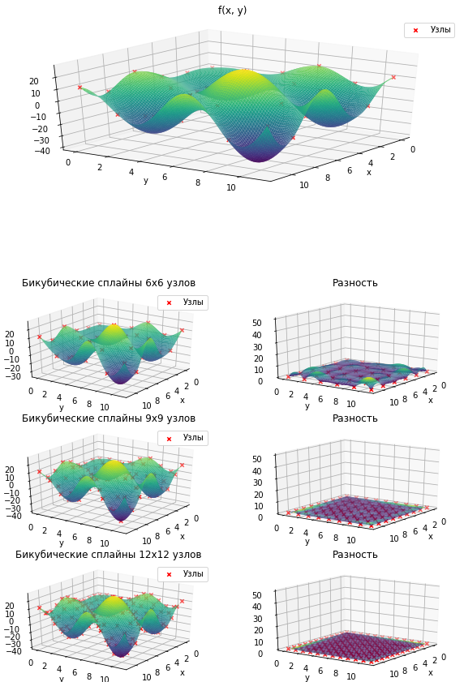
